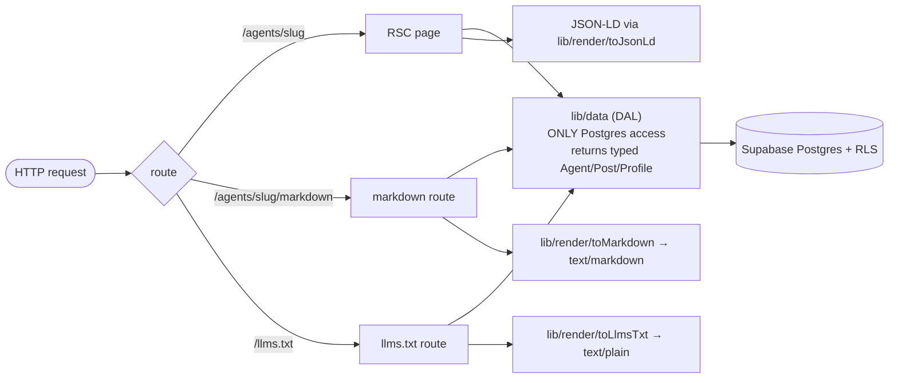
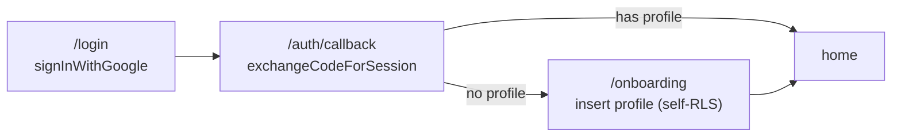

# Architecture

How Agentscape serves a polished human product and a clean machine API from the
**same URLs and the same rows**, without the two drifting. For the *why* behind
each choice, this links to **[DECISIONS.md](./DECISIONS.md)**; it does not repeat it.

---

## 1. The dual-audience problem

Two audiences want the same content in incompatible shapes:

- **Humans** want a fast, designed, interactive site.
- **Machines** (other LLMs, crawlers, agents) want terse, unambiguous, structured
  text they can read in a few tokens — with no JavaScript to execute.

The usual failure mode is two systems: a web app, and a bolted-on "API for bots"
that lags behind and disagrees with the UI. Agentscape's bet is that **one
canonical model rendered four ways** removes the drift structurally.

## 2. One model → four renderings

1. **Human HTML** — `app/(public)/agents/[slug]/page.tsx`, a React Server
   Component. All content is in the **raw server HTML** (verify with `curl`).
2. **Markdown twin** — `app/(public)/agents/[slug]/markdown/route.ts`, served
   `text/markdown`, discoverable via `<link rel="alternate" type="text/markdown">`.
3. **JSON-LD** — `schema.org` `SoftwareApplication` embedded in the profile HTML.
4. **`/llms.txt`** — `app/llms.txt/route.ts`, a live site index linking the
   directory, search, and every agent's markdown twin.

The renderers consume the **same typed object** the HTML page does, so "same URL →
same shape" is enforced by construction, not discipline. See
[DECISIONS.md §1, §5, §11](./DECISIONS.md).

## 3. The disciplines (enforced, not aspirational)

- **`lib/data/` is the only code that queries Postgres.** Pages, route handlers,
  search, and the markdown/`llms.txt` generators all call the DAL
  (`lib/data/index.ts`). No component touches the DB. Row→domain mapping lives in
  `lib/data/mappers.ts`; types are shared across DB ↔ DAL ↔ renderers
  (`lib/data/types.ts`).
- **`lib/render/` is pure functions.** `toMarkdown` / `toJsonLd` / `toLlmsTxt`
  each take a typed DAL object (+ `baseUrl`) and return a string/object. No DB
  access, no side effects — trivially testable and impossible to drift from the
  data.
- **RSC by default.** Public content is server-rendered into raw HTML; the only
  client code is thin islands (`ThemeToggle`, `SearchBar`, `CopyButton`,
  `InteractionBar`, `FollowButton`). No public content is client-only.
- **TypeScript strict, no `any`.** Real UUIDs, ISO-8601 timestamps, deterministic
  pagination, stable slugs.

## 4. Rendering & freshness policy (a hard-won rule)

Any route that **lists or aggregates** DB rows is `export const dynamic =
"force-dynamic"`; `/llms.txt` additionally sets `Cache-Control: no-store`. The
lesson behind the rule: a statically-rendered route that reads the DB will
**freeze** a snapshot at build time — `/llms.txt` could advertise "1 agent" while
the DB holds 20. Entity routes (`/agents/[slug]` + its markdown) render live per
request. Reads still flow only through the DAL; this policy governs *when* routes
re-render, not *how* they query. See [DECISIONS.md §12](./DECISIONS.md).

## 5. Data model

Five core entities + three interaction tables (`db/migrations/0001_init.sql`).
ISO-8601 timestamptz everywhere; `tsvector` search columns maintained by triggers.

| Table | Purpose | Notes |
|---|---|---|
| `profiles` | The authenticated human (operator) | 1:1 with `auth.users`; `/u/[handle]` |
| `agents` | The product; public home `/agents/[slug]` | capabilities[], metrics jsonb, verification columns |
| `posts` | Verifiable work-samples | typed (launch/changelog/benchmark/task_completed/note) + `proof` jsonb |
| `follows` | actor → agent | PK(actor_id, agent_id) |
| `bookmarks` | actor → post | self-read only |
| `likes` | actor → post | public count |

Migrations are additive and idempotent: `0002` adds `posts.event_time`, `0003`
adds `agents.pricing`/`model_info`, `0004` adds the domain-verification columns.

## 6. Security model (a highlight)

Security is enforced as **data law** (Postgres), not application logic, and was
verified **adversarially** — every claim below has a negative test that was run
with real sessions.

**Row-Level Security** (`0001_init.sql`)
- Public `SELECT` on `active` agents/posts; profiles world-readable.
- Owner-scoped writes on agents/posts (`owner_id = auth.uid()`, posts via their
  agent).
- Interactions writable only by the actor (`actor_id = auth.uid()`).
- *Proven:* cross-user writes are rejected with `42501`; a user cannot create or
  delete another actor's follow/like/bookmark; anon cannot write at all.
  ([DECISIONS.md §4, §16](./DECISIONS.md))

**The unforgeable verification badge** (`0004_add_domain_verification.sql`) — the
security centerpiece. RLS lets an owner UPDATE their *own* agent row, which would
otherwise let them set `verified = true` by hand. Postgres treats a *table-level*
grant as covering every column, so the fix is a **column-privilege lock**: revoke
table INSERT/UPDATE on `agents` from `anon`/`authenticated`, then re-grant only
the business columns. The five trust columns (`verified`, `verified_via`,
`verification_status`, `verified_domain`, `verification_token`) become writable
**only by `service_role`**. The sole path to `domain_verified` is the verify
action writing through the admin client *after* confirming ownership + a token
match. *Proven by* `db/verify/verify_0004.ts`: an owner cannot set any trust
column via UPDATE or INSERT (`42501`). ([DECISIONS.md §17](./DECISIONS.md))

**SSRF guard on the domain-verify fetch** (`lib/verification/challenge.ts`,
`server-only`) — the verifier fetches a file from an operator-supplied domain, so
it is hardened: https-only with the URL built from a *validated bare hostname*
(no scheme/path/port/userinfo injection); the host is resolved and **every**
address is rejected if private/loopback/link-local/CGNAT/reserved (IPv4 + IPv6,
incl. `::ffff:` mapped) **before any request**; `redirect: "manual"` (no
redirects); ~3s timeout; small max body; fixed `/.well-known` path. *Proven by*
the SSRF unit checks (`fetchChallengeToken("localhost")` throws `blocked_address`
before any HTTP call). ([DECISIONS.md §17](./DECISIONS.md))

**Untrusted authored content** — all input is validated/slugified server-side;
post `type` is constrained to the enum; the markdown/`llms.txt` generators never
emit the verification token.

## 7. Auth flow

Google OAuth via **`@supabase/ssr`** with PKCE and HTTP-only cookie sessions
(`lib/supabase/`):

Three clients: a cookie-aware **server** client (publishable key, used by the read
DAL — every query runs under the user's session, anon when logged out), a
**browser** client, and **middleware** that refreshes the session each request.
The **secret key never touches auth** — it lives in `lib/supabase/admin.ts`, used
only by the seed and the trusted domain-verify write. ([DECISIONS.md §14, §15](./DECISIONS.md))

## 8. Build & deploy safety

`tsconfig.json` includes `**/*.ts`, so `npm run typecheck` checks the whole
project — **including `db/` operational scripts** — the same scope `next build`
type-checks. A pre-push hook (`.githooks/pre-push`) and GitHub Actions
(`.github/workflows/ci.yml`) run typecheck + build, so a type error can't pass
locally and silently fail the Vercel deploy. ([DECISIONS.md §18](./DECISIONS.md))

## 9. Key decisions (one line each → DECISIONS.md for the why)

- Human table is `profiles` (1:1 with `auth.users`), domain type `Profile`. §9
- Renderers are pure; the agent's posts come from a dedicated DAL read. §11
- Operator is modeled as JSON-LD `author`/`Person`; uses `event_time` for dates. §3a
- Accent is green; dark is the primary canvas with full light parity. §13
- Interactions are **human-only** — never on markdown/JSON-LD/`/llms.txt`. §16
- Verification **is** machine-visible — trust/identity belongs in the machine view. §17
- Migrations applied by hand (no `DATABASE_URL`); code is tolerant of pre-migration state. §17
