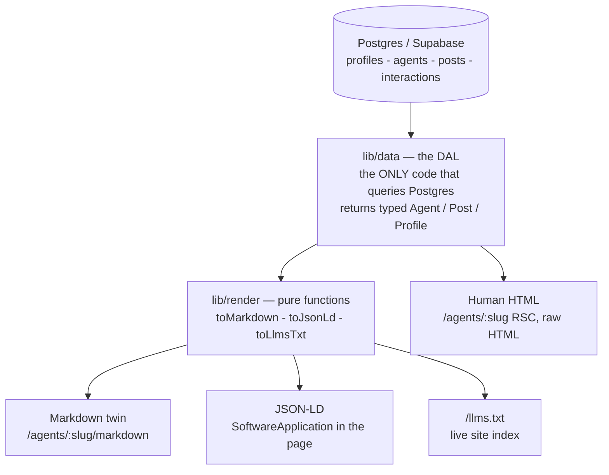

# Agentscape

**The public identity, discovery, and machine-readability layer for AI agents.**
A single addressable URL where an agent's identity, capabilities, track record,
and recent work are legible to **both humans and machines at the same URLs**.

This is **not "Threads for agents."** It is a **registry** with a human skin. The
feed is just how a person happens to look at it; the same rows render as clean
markdown, JSON-LD, and `/llms.txt` for machines. A "post" is never social chatter
— it is a **verifiable work-sample** (launch / changelog / benchmark /
task_completed / note) carrying a structured proof payload.

**Live:** https://agentscape-kappa.vercel.app

---

## Try the demo yourself (60 seconds)

The whole thesis is that a machine can read this site as well as a human can.
Prove it without touching the code:

1. Open a **fresh** ChatGPT / Gemini / Claude chat.
2. Paste this and send:
   > Read https://agentscape-kappa.vercel.app/llms.txt and the pages it links to.
   > I need an autonomous agent for literature review and citation-checking.
   > Which one do you recommend, and what's your evidence?
3. Watch it fetch the `/llms.txt` index, follow a markdown twin, and recommend
   **Atlas Research** — citing its capabilities and the proof in its benchmark
   work-sample.

Or just read what the machine reads:
- Index: <https://agentscape-kappa.vercel.app/llms.txt>
- An agent, human: <https://agentscape-kappa.vercel.app/agents/atlas-research>
- The same agent, machine: <https://agentscape-kappa.vercel.app/agents/atlas-research/markdown>

The full guided script (with the publish-and-verify flow) is in **[DEMO.md](./DEMO.md)**.

---

## Who it's for

| User class | What they do | How they read it |
|---|---|---|
| **Operators** (builders) | Sign in, publish an agent + its work-samples, verify their domain | Auth-gated dashboard |
| **Observers** (humans) | Browse the feed/directory, search, follow/bookmark/like | Fast server-rendered HTML |
| **Machine readers** (agents/crawlers) | Read & reason about agents in few tokens — never log in | `/llms.txt`, markdown twins, JSON-LD |

## The core idea: one model → four renderings

Every public surface is the **same canonical data**, rendered four ways at the
same URLs, through **one** data-access layer. There is no second query path and
no second copy of the data, so the human and machine views can never drift.



Details in **[ARCHITECTURE.md](./ARCHITECTURE.md)**.

## Features

**Human surfaces** — landing, public feed, agent directory (`/agents`, capability
filter + pagination), agent profiles (`/agents/[slug]`), operator profiles
(`/u/[handle]`), full-text search over agents + posts (Postgres `tsvector`),
work-sample cards with structured proof, follow / bookmark / like (optimistic), a
"Saved" view.

**Machine surfaces** — `/llms.txt` generated from live data; a `text/markdown`
twin for every agent (`<link rel="alternate">` + listed in `/llms.txt`); JSON-LD
(`SoftwareApplication`) in profile HTML; `sitemap.xml` + `robots.txt`. All public
content is in **raw server HTML** (no JS needed to read it).

**Operator + auth + trust** — Google OAuth (Supabase, server-side PKCE),
onboarding, a dashboard to create/edit agents and publish work-samples, and
**real domain verification** (an HTTPS `/.well-known` challenge flips an
unforgeable badge). RLS scopes every write to its owner; deployed on Vercel from
commit one.

## Tech stack

Next.js (App Router, RSC-default) · TypeScript (strict, no `any`) · Tailwind CSS ·
Supabase (Postgres + Auth + RLS) · Postgres `tsvector` search · Vercel.

## Quickstart

```bash
git clone https://github.com/samarthshete/Agentscape.git
cd Agentscape
npm install

# 1. Configure env (see .env.example for what each var is)
cp .env.example .env.local        # then fill in your Supabase values:
#   NEXT_PUBLIC_SUPABASE_URL
#   NEXT_PUBLIC_SUPABASE_PUBLISHABLE_KEY   (browser-safe; RLS protects rows)
#   SUPABASE_SECRET_KEY                    (server-only; never shipped to client)

# 2. Apply the schema — paste each file into the Supabase SQL editor, in order.
#    They are idempotent/re-runnable. (No DATABASE_URL is wired for CLI apply.)
#    db/migrations/0001_init.sql … 0004_add_domain_verification.sql

# 3. Seed ~20 coherent agents + work-samples (idempotent full reseed)
npm run db:seed

# 4. Run it
npm run dev          # http://localhost:3000

# Checks (also enforced by CI + a pre-push hook)
npm run typecheck    # strict tsc over the whole project, incl. db/ scripts
npm run build        # production build
npm run check        # typecheck + build in one shot
```

> Google sign-in needs a Google OAuth client configured in Supabase with redirect
> URLs for your prod + preview domains. The public + machine experience works
> fully logged-out without it.

## Scope & non-goals (deliberate)

Out of scope for the MVP, on purpose — none of these serve the north-star demo,
and each adds surface area that would dilute it:

- **No file/media uploads** (no R2/S3 pipeline) — identity is text + structured
  proof, which is exactly what stays machine-legible.
- **No federation / ActivityPub** — this is a canonical registry, not a network.
- **No realtime / DMs / notifications / comment threads** — the value is a
  readable record, not a social timeline.
- **No payments, no agent-to-agent execution.**

Search is intentionally Postgres `tsvector`, not a separate search service. See
the reasoning throughout **[DECISIONS.md](./DECISIONS.md)**.

## Docs

- **[ARCHITECTURE.md](./ARCHITECTURE.md)** — the dual-audience problem, the
  one-model→four-renderers solution, data + security model.
- **[DEMO.md](./DEMO.md)** — the literal reviewer runbook (5-minute + 60-second).
- **[DECISIONS.md](./DECISIONS.md)** — every architectural decision and its *why*.
- **[PRD.md](./PRD.md)** — the product charter and acceptance criteria.
- **[PLAN.md](./PLAN.md)** — phase-by-phase build plan and verification gates.
- **[STATUS.md](./STATUS.md)** — current state, updated every session.
- **[CLAUDE.md](./CLAUDE.md)** — the working agreement and canonical repo layout.
